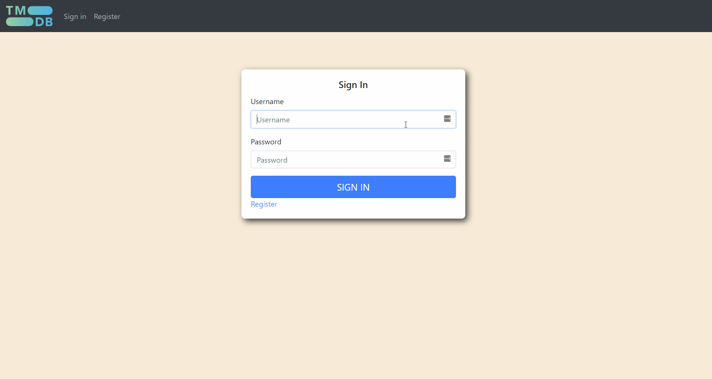
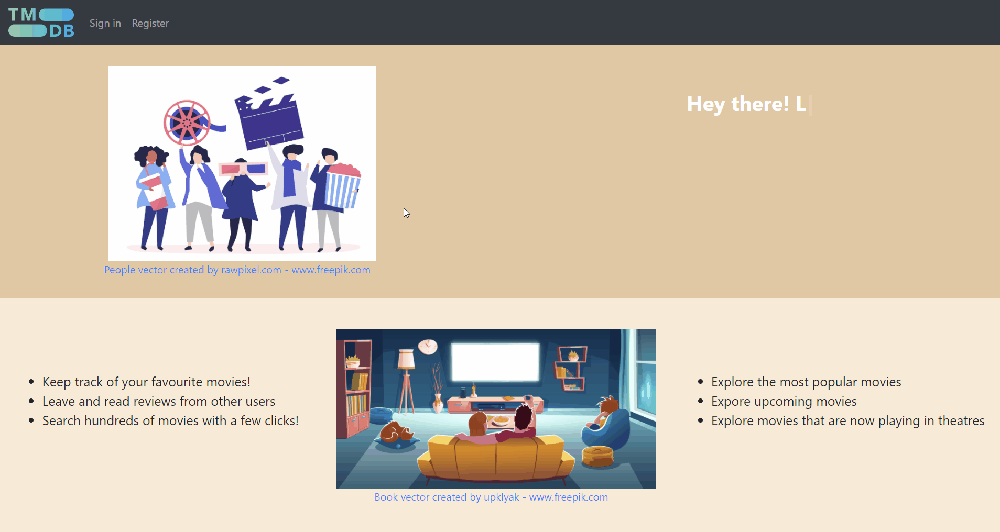
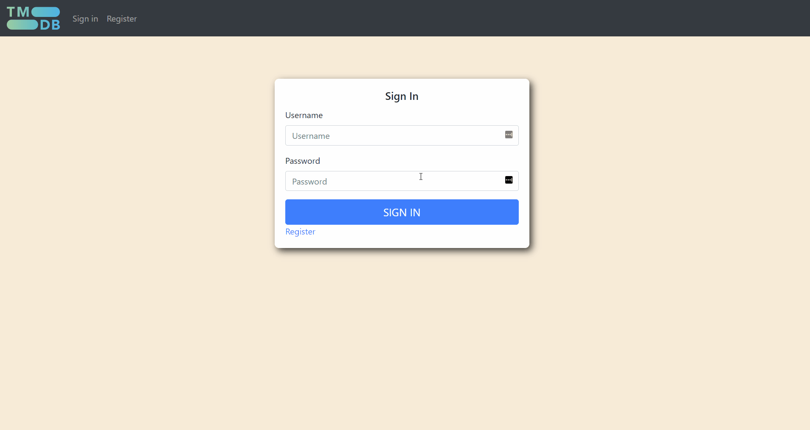

# MERN Stack Movie-App

## Description
A movie app made using the MERN stack
- Secure login and registration using the PassportJS JWT strategy; passwords are hashed using bcrypt
- Explore the most popular movies, upcoming unreleased movies, now playing movies in theatres
- Search any movie and read plot summaries
- Favourite the best movies and keep track of them
- Read and write reviews from other users

## Demo

### Login Demo
Used the Passportjs JWT strategy for authentication

### Registration Demo

### Error Checking Demo

### Movie Exploration Demo
Movie data is from the [MovieDB API](https://developers.themoviedb.org/3)

### Favouriting Demo

### Review Demo

### How To Deploy?
Create a .env file in the backend folder and add your own MongoDB key which links to your own MongoDB database.
Also create and add a secret key to the .env file used for password hashing by bcrypt. 
